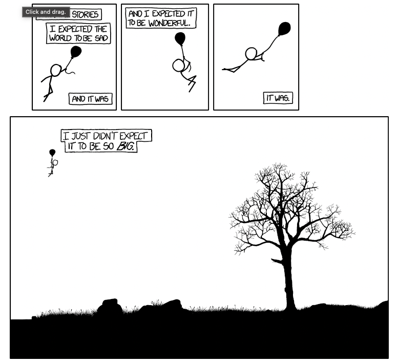

# XKCD—Click and Drag



This repository contains the complete image of the "Click and Drag" comic by XKCD. You can view the original comic [here](https://xkcd.com/1110/).

The repository includes the following files:

- [images/tiles](./images/tiles): The individual tiles as they appear on the XKCD website.
- [images/rows](./images/rows): Five files, each representing another part of the full comic.
- [xkcd-click-and-drag.png](./xkcd-click-and-drag.png): The full comic in high resolution.
- [xkcd-click-and-drag.xcf](./xkcd-click-and-drag.xcf): The Gimp file that combines all the rows. Be aware that this file requires approximately 43GB of memory to open.

All the source code used to fetch and combine the images is available in the [src](./src) directory.

Enjoy 🎉

---

The code can be executed with the following parameters:

```shell
Usage: program [options]
Options:
  -h --help            Print this help message
  -d --directory       Specify the directory to save the images (default: /images)
  -f --fetch           Run the fetch process
  -c --combine         Run the combine process (using the maximum number of rows possible per image)
  -C --combine-all     Run the combine process with all images (each tile is 256x256 pixels)
  -a --all             Run both fetch and combine processes
```
